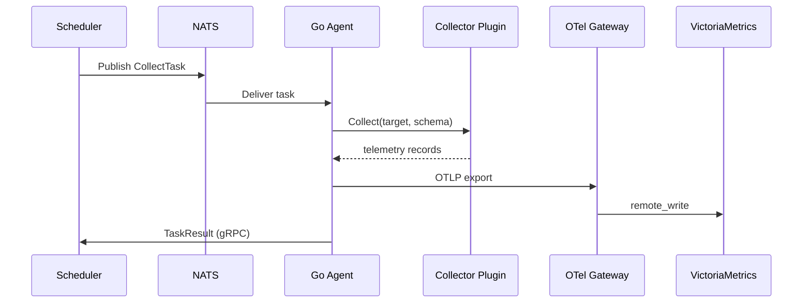
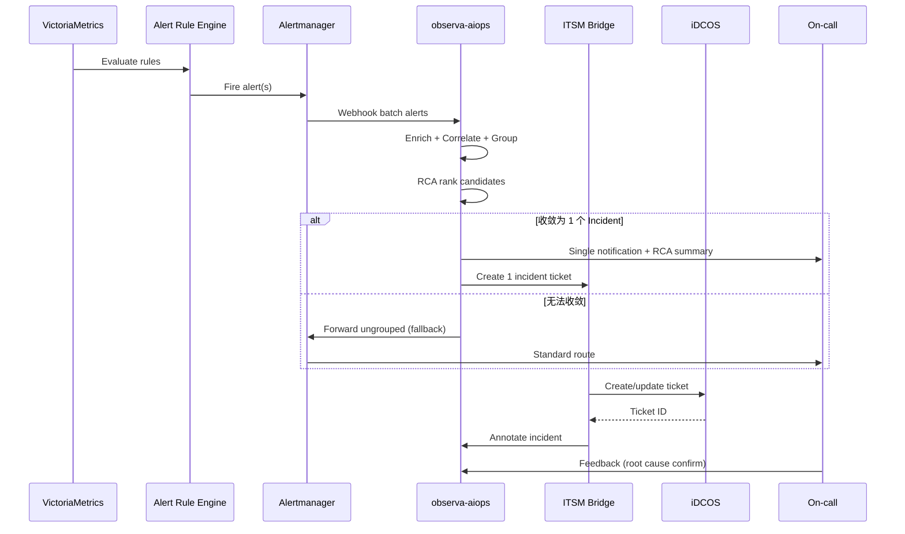
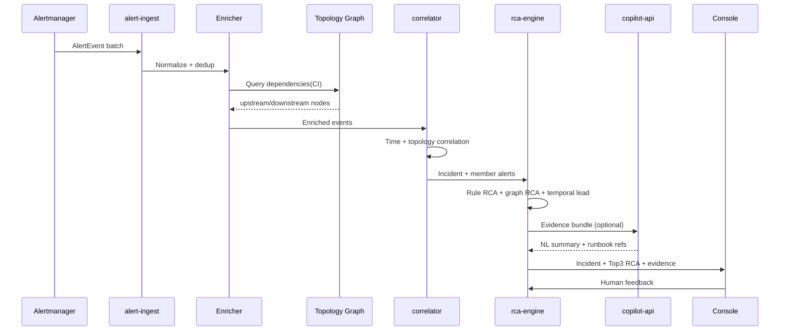

# ObservaForge — Go 语言监测运维平台架构设计

> **项目**: [ObservaForge](https://github.com/observa-forge/observa-forge) · 仓库名 `observa-forge`  
> **版本**: v0.2（架构草案，含 AIOps 智能运维层）  
> **目标**: 面向 SRE 职业转型的可观测性 + 运维平台学习/实战项目  
> **参考产品**: [DCOS](https://www.cloudsino.cn/products/dcos) · [iDCOS](https://www.cloudsino.cn/products/idcos)  
> **参考开源**: OpenTelemetry · Prometheus · Grafana · Loki · Tempo · Alertmanager · Correlation/RCA 开源实践  
> **智能运维**: AIOps — 告警聚合 · 收敛 · 根因分析 · 异常检测 · 智能推荐  
> **现状基线**: `c:\work\observa-forge` · `c:\work\OOBS` · `c:\work\Server` · `c:\work\iDCOS` · `c:\work\monitor-manager-agent`

---

## 1. 背景与目标

### 1.1 为什么要做

现有 CloudSino 产品体系已经覆盖了完整的 IT 运维链路：

| 产品 | 定位 | 现有实现 |
|------|------|----------|
| **DCOS** | 硬件层带外监测、远程控制、部件级资产 | Java + XML 模型驱动 + RMI 分布式采集（`OOBS` + `Server`） |
| **iDCOS** | ITSM / CMDB / 告警工单闭环 / 自动化 | Java Spring + Vue 前端 + Manager/Agent |
| **monitor-manager-agent** | DCOS/iDCOS 监控模块的现代化重构 | Java 8 Maven 多模块，SSL RMI + Kafka + MQTT |

这些系统的核心能力（多协议采集、模型驱动、Manager/Agent 分离、告警闭环）仍然有效，但技术栈与云原生/SRE 主流实践存在差距：

- 通信依赖 Java RMI，跨语言、跨云部署困难
- 指标/日志/链路未统一到 OpenTelemetry 语义
- 缺少 Prometheus 风格的 Pull 模型与 PromQL 生态
- 告警规则、SLO、On-call 未对齐 Grafana/Alertmanager 最佳实践
- 告警风暴时缺少聚合、收敛与根因定位，运维仍依赖人工经验（SmartBSM 能力未平台化）
- Java Agent 资源占用高，不适合边缘/容器化大规模部署

**ObservaForge** 是一个以 **Go** 为核心、对齐 **CNCF 可观测性标准** 的下一代监测运维平台。它既是对现有 DCOS/iDCOS 能力的现代化承载，也是 SRE 技能体系的完整实战载体。

### 1.2 设计原则

1. **Cloud Native First** — 容器化、水平扩展、GitOps 部署
2. **Open Standards** — OpenTelemetry 语义、Prometheus 指标格式、OTLP 传输
3. **Pluggable Collectors** — 保留 DCOS「模型 + 插件」思想，用 Go plugin/WASM/独立 binary 实现
4. **Gradual Migration** — 与现有 Java Agent/Manager 并存，Kafka/OTLP 桥接，而非一次性替换
5. **SRE Practices Built-in** — SLO/SLI、Error Budget、Runbook、Incident 从第一天纳入设计
6. **Intelligence Layered** — AIOps 分层落地：规则关联 → 统计异常 → 拓扑 RCA → LLM 辅助，避免「一上来全用大模型」

### 1.3 非目标（v1 不做）

- 完整替换 iDCOS 全部 ITSM 流程引擎
- 重写全部 500+ 设备驱动（优先桥接 + 高频驱动 Go 化）
- 自研时序数据库（直接使用 VictoriaMetrics / Mimir）
- 自研可视化（Grafana 为主，自研 Console 为辅）
- v1 不追求全自动无人值守闭环（AIOps 输出以「推荐 + 人工确认」为主）

---

## 2. 总体架构

### 2.1 逻辑分层

```
┌─────────────────────────────────────────────────────────────────────────┐
│                         体验层 (Experience)                              │
│   Grafana Dashboards │ Alertmanager │ On-call (PagerDuty/Opsgenie)      │
│   Web Console (Go + React) │ Runbook Wiki │ AIOps 事件视图 │ Mobile Push │
└─────────────────────────────────────────────────────────────────────────┘
                                    ▲
┌─────────────────────────────────────────────────────────────────────────┐
│                    智能运维层 (AIOps Intelligence)                         │
│   Alert Correlator │ Incident Grouper │ RCA Engine │ Anomaly Detector   │
│   Topology Graph │ LLM Copilot │ Runbook Recommender │ Noise Reducer    │
└─────────────────────────────────────────────────────────────────────────┘
                                    ▲
┌─────────────────────────────────────────────────────────────────────────┐
│                         控制平面 (Control Plane)                           │
│   API Gateway │ Scheduler │ Policy Engine │ CMDB Sync │ ITSM Bridge     │
│   Config Server │ RBAC/Auth (OIDC) │ Audit Log                          │
└─────────────────────────────────────────────────────────────────────────┘
                                    ▲
┌─────────────────────────────────────────────────────────────────────────┐
│                         数据平面 (Data Plane)                            │
│   OTel Collector Gateway │ Prometheus/VictoriaMetrics │ Loki │ Tempo    │
│   ClickHouse (事件/资产/长周期) │ Redis (缓存/队列) │ PostgreSQL (元数据)  │
└─────────────────────────────────────────────────────────────────────────┘
                                    ▲
┌─────────────────────────────────────────────────────────────────────────┐
│                         采集层 (Collection)                              │
│   Go Agent (DaemonSet) │ OTel Collector Agent │ SNMP/Redfish Exporter   │
│   Legacy Java Agent Bridge │ Syslog/Trap Receiver │ eBPF (可选)           │
└─────────────────────────────────────────────────────────────────────────┘
                                    ▲
┌─────────────────────────────────────────────────────────────────────────┐
│                         被管对象 (Targets)                               │
│   服务器 BMC │ 网络/存储/安全设备 │ OS/容器/K8s │ 数据库/中间件 │ 动环    │
└─────────────────────────────────────────────────────────────────────────┘
```

### 2.2 与现有系统映射

| 现有概念 (DCOS/iDCOS) | ObservaForge 对应 | 说明 |
|----------------------|---------------------|------|
| `DeviceClass` / `MonitorClass` (XML) | **Collector Schema Registry** | YAML/Protobuf 定义，版本化管理 |
| `Meta` / `MonitorResult` | **OTel Resource + Metric/Log Record** | 统一语义，保留 `identify`/`part` 为 attribute |
| `MonitorManager` / `CollectWorkQueue` | **Scheduler Service** | 分布式任务调度，替代 RMI 下发 |
| Java Agent | **Go Agent (`observa-agent`)** | gRPC/OTLP 与控制平面通信 |
| SSL RMI | **mTLS gRPC + NATS JetStream** | 配置下发 + 任务队列 |
| Kafka `monitor-data` | **OTLP → Kafka → VM/Loki** | 保留 Kafka 作为缓冲层 |
| ClickHouse 时序 | **ClickHouse + VictoriaMetrics** | 指标走 VM，事件/日志走 CH/Loki |
| iDCOS 工单/CMDB | **ITSM Bridge Service** | Webhook/API 对接，不重建 ITSM |
| DCOS 带外远程控制 | **OOB Control Service** | IPMI/Redfish API 封装，审计留痕 |
| SmartBSM 告警关联/根因 | **AIOps Engine (`observa-aiops`)** | 拓扑 + 时序 + 规则 + LLM 分层 RCA |
| 告警泛滥/重复工单 | **Incident Grouper + Noise Reducer** | 聚合成 Incident，抑制衍生告警 |
| 变更/故障复盘 | **Change Correlation + Postmortem Assist** | 关联变更事件，辅助生成复盘摘要 |

### 2.3 部署拓扑（推荐）

```
                    ┌──────────────┐
                    │   Ingress    │
                    └──────┬───────┘
           ┌───────────────┼───────────────┐
           ▼               ▼               ▼
    ┌─────────────┐ ┌─────────────┐ ┌─────────────┐
    │  Console    │ │  Grafana    │ │  API GW     │
    │  (React)    │ │             │ │  (Go)       │
    └─────────────┘ └──────┬──────┘ └──────┬──────┘
                           │               │
              ┌────────────┴───────────────┴────────┐
              ▼                                     ▼
    ┌──────────────────┐   ┌──────────────────┐   ┌──────────────────┐
    │ Control Plane    │◄─►│ AIOps Engine     │◄─►│ OTel Collector   │
    │ (K8s Deployment) │   │ (observa-aiops)       │   │ Gateway          │
    └────────┬─────────┘   └────────┬─────────┘   └────────┬─────────┘
             │                      │                        │
             │              ┌───────┴───────┐                │
             │              │ Neo4j / PG    │                │
             │              │ Vector DB     │                │
             │              └───────────────┘                │
             │                                   │
    ┌────────┴────────┐              ┌───────────┴───────────┐
    │ PostgreSQL      │              │ VM Cluster │ Loki │ Tempo│
    │ Redis/NATS      │              │ ClickHouse              │
    └─────────────────┘              └─────────────────────────┘
             ▲                                   ▲
             │         mTLS / OTLP / NATS        │
    ┌────────┴───────────────────────────────────┴────────┐
    │  Go Agent (机房 A)  │  Go Agent (机房 B)  │ K8s DS   │
    │  Java Bridge Agent  │  SNMP Exporter      │ OTel SDK │
    └─────────────────────────────────────────────────────┘
```

---

## 3. 技术栈选型

### 3.1 核心语言与框架

| 层级 | 技术 | 选型理由 |
|------|------|----------|
| 后端服务 | **Go 1.22+** | 高并发、静态编译、K8s 生态原生、SRE 岗位主流 |
| HTTP/gRPC | **Gin / Echo** + **gRPC-Go** | 轻量 REST + 高性能 RPC |
| 依赖注入 | **Wire** 或 **Fx** | 可测试、模块化 |
| 配置 | **Viper** + **etcd** | 本地 + 分布式配置 |
| ORM | **sqlc** 或 **GORM** | 类型安全 SQL（推荐 sqlc） |

### 3.2 可观测性标准栈（CNCF）

| 能力 | 组件 | 角色 |
|------|------|------|
| **Instrumentation** | OpenTelemetry Go SDK | Agent 内嵌，统一 Traces/Metrics/Logs |
| **Collection** | OTel Collector (contrib) | Agent 侧 + Gateway 侧，processor 丰富 |
| **Metrics** | **VictoriaMetrics** (或 Mimir) | Prometheus 兼容，高压缩、高吞吐 |
| **Metrics Query** | PromQL / MetricsQL | SRE 标准查询语言 |
| **Logs** | **Grafana Loki** | 标签索引，与 Grafana 深度集成 |
| **Traces** | **Grafana Tempo** | 与 Loki/Metrics 关联（Exemplars） |
| **Visualization** | **Grafana 11+** | Dashboard、Alerting、On-call |
| **Alerting** | **Alertmanager** + Grafana Unified Alerting | 路由、抑制、静默 |
| **Service Discovery** | Prometheus SD / K8s SD | 动态 target 管理 |

### 3.3 消息与存储

| 用途 | 技术 | 说明 |
|------|------|------|
| 任务/配置下发 | **NATS JetStream** | 替代 RMI，支持 at-least-once |
| 高吞吐缓冲 | **Kafka**（可选） | 与现有 iDCOS 兼容，Bridge 模式 |
| 元数据/CMDB | **PostgreSQL 16** | 设备、监测器、用户、审计 |
| 缓存/分布式锁 | **Redis 7** | 会话、限流、Leader 选举 |
| 长周期事件/资产 | **ClickHouse** | 保留现有 CH 投资，告警历史/资产变更 |
| 对象存储 | **MinIO / S3** | 配置文件、报告、Runbook 附件 |

### 3.4 基础设施与交付

| 类别 | 技术 |
|------|------|
| 容器编排 | **Kubernetes 1.29+** |
| 包管理 | **Helm 3** |
| GitOps | **Argo CD** |
| CI/CD | **GitHub Actions** / GitLab CI |
| IaC | **Terraform** + **Crossplane**（可选） |
| Secret | **Vault** 或 K8s External Secrets |
| 身份认证 | **Keycloak** / **Authentik**（OIDC） |

### 3.5 前端（Console）

| 技术 | 说明 |
|------|------|
| **React 18** + **TypeScript** | 管理控制台 |
| **Ant Design / shadcn/ui** | 组件库 |
| **TanStack Query** | 数据获取 |
| 嵌入 **Grafana Panel** | 复用可视化，减少重复建设 |

### 3.6 AIOps 与智能分析

| 能力 | 技术 | 角色 |
|------|------|------|
| **告警接入** | Alertmanager Webhook / Kafka `alarm-list` | 统一告警事件流 |
| **规则关联** | 自研 **Correlation Engine** (Go) | 时间窗 + 拓扑 + 标签匹配 |
| **拓扑图** | **Neo4j** 或 PostgreSQL + **graph** 扩展 | CMDB 依赖、机柜/U 位、网络链路 |
| **时序异常** | **VictoriaMetrics** + **Prometheus ML** / **Grafana ML** | 基线、季节性、离群点 |
| **日志异常** | **Loki** + pattern mining | 日志模板聚类、错误突增 |
| **向量检索** | **Qdrant** / **pgvector** | Runbook/历史 Incident 相似检索 |
| **LLM 推理** | **Ollama** (本地) / OpenAI API (可选) | RCA 摘要、处置建议、复盘草稿 |
| **LLM 编排** | **LangChainGo** / 自研 Prompt Pipeline | 工具调用：查拓扑、查指标、查变更 |
| **特征/训练** | **Python Sidecar** (可选) | 复杂模型训练，Go 侧只做推理调度 |
| **可解释性** | 规则链 + 证据链 (Evidence Graph) | 每条 RCA 结论必须附带可追溯证据 |

**设计取舍**: 默认以 **可解释的规则 + 拓扑** 为主路径；统计异常与 LLM 为增强层。LLM 只生成「建议」，不自动执行变更或关单。

---

## 4. 核心组件设计

### 4.1 Go Agent (`observa-agent`)

**职责**: 替代/补充 Java Agent，在被管网络边缘执行采集。

```
observa-forge/cmd/agent/   # 二进制名 observa-agent
├── main.go                  # 主入口
├── internal/
│   ├── scheduler/       # 本地采集调度（对标 MonitorTask）
│   ├── collector/       # 采集器插件注册表
│   ├── transport/       # OTLP/gRPC 上报
│   ├── config/          # 远程配置热更新
│   └── bridge/          # Java Agent 协议桥接（过渡期）
├── plugins/
│   ├── snmp/            # SNMP 采集（gosnmp）
│   ├── redfish/         # HTTP Redfish（对标 DCOS 带外）
│   ├── ipmi/            # IPMI（goipmi）
│   ├── ping/            # 连通性
│   ├── jdbc/            # 数据库（database/sql）
│   └── script/          # 脚本采集（对标 MonitorClass.script）
└── deploy/
    ├── Dockerfile
    ├── helm/
    └── systemd/
```

**关键设计**:

- **插件接口** — 对齐 DCOS `IDeviceMonitor`，Go 定义：

  ```
  type Collector interface {
      Name() string
      Collect(ctx context.Context, target Target, schema MonitorSchema) ([]telemetry.Record, error)
  }
  ```

- **Target 模型** — 映射 `Device`：`device_id`, `node_class`, `endpoint`, `credentials_ref`, `labels`
- **MonitorSchema** — 映射 `MonitorClass` + `Meta`：从 Schema Registry 拉取
- **上报路径** — 本地 OTel Collector → Gateway → VictoriaMetrics/Loki
- **配置下发** — Control Plane → NATS → Agent，替代 `setAgentConfig` RMI 调用
- **资源限制** — cgroups 限制 CPU/内存，适合容器 DaemonSet

**与 Java Agent 共存**:

```
Java Agent ──Kafka(monitor-data)──► Bridge Consumer ──OTLP──► Gateway
Go Agent   ──────────OTLP──────────────────────────────────► Gateway
```

### 4.2 Control Plane (`observa-control`)

**职责**: 平台大脑，对标 Manager + OOBS BLL。

| 微服务 | 职责 | 对标现有 |
|--------|------|----------|
| **api-server** | REST/gRPC API，RBAC | iDCOS Web API |
| **scheduler** | 采集任务编排、分片、重试 | `CollectWorkQueue` + `MonitorManager` |
| **schema-registry** | 监测模型 CRUD、版本发布 | `ClassManager` + XML 模型 |
| **discovery** | 设备发现、自动纳管 | `IDiscovery` |
| **alert-engine** | 规则评估、告警状态机 | BSMAlarm + Kafka alarm |
| **itsm-bridge** | 告警 → 工单 | iDCOS ITSM |
| **cmdb-sync** | 资产/配置项同步 | iDCOS CMDB |
| **oob-controller** | 远程开关机/KVM 代理 | DCOS 带外控制 |
| **audit-service** | 操作审计 | DCOS 操作审计 |

**AIOps 微服务**（`observa-aiops`，可与 Control Plane 同集群部署）:

| 微服务 | 职责 |
|--------|------|
| **alert-ingest** | 消费 Alertmanager / Kafka / 自研 alert-engine 事件，标准化为 `AlertEvent` |
| **correlator** | 告警聚合、时间关联、拓扑关联、变更关联 |
| **grouper** | 将相关告警收敛为 **Incident**（事件），分配唯一 incident_id |
| **noise-reducer** | 重复告警抑制、抖动过滤、维护窗口感知、告警升级/降级 |
| **rca-engine** | 根因候选排序，输出 evidence + confidence |
| **anomaly-detector** | 指标/日志异常检测，可前置产生「预测性告警」 |
| **topology-sync** | 从 CMDB/K8s/LLDP 同步依赖图，供关联与 RCA 使用 |
| **copilot-api** | LLM 对话：解释 Incident、推荐 Runbook、生成工单摘要 |
| **feedback-loop** | 收集人工确认/误报标记，用于规则调优与模型再训练 |

**Scheduler 设计要点**:

- 任务模型：`{device_id, monitor_id, interval, timeout, agent_id, priority}`
- 分片策略：按 `agent_id` + 哈希均衡，支持 `privateAgent` 私网转发语义
- 失败重试：指数退避 + 死信队列（NATS）
- 分布式：Scheduler 多副本 + Redis 选主 + 任务幂等

### 4.3 OTel Collector 拓扑

**Agent 侧** (每台采集节点):
```yaml
receivers:
  otlp:
  prometheus:        # 自采集 agent 自身 metrics
  syslog:
  snmp:              # snmp receiver (contrib)

processors:
  batch:
  memory_limiter:
  attributes:        # 注入 device_id, site, tenant
  filter:            # 丢弃无效数据

exporters:
  otlp:              # → Gateway
  debug:

service:
  pipelines:
    metrics: [otlp, prometheus, snmp, batch, attributes, otlp]
    logs: [syslog, batch, attributes, otlp]
```

**Gateway 侧** (集群中心):
```yaml
processors:
  metricstransform:  # DCOS perf 名 → 标准 metric 名
  routing:           # 按 tenant 路由

exporters:
  prometheusremotewrite:  # → VictoriaMetrics
  loki:
  kafka:                  # → 兼容现有消费者
  clickhouse:             # 事件/资产变更
```

### 4.4 Schema Registry（模型驱动）

保留 DCOS XML 模型的核心思想，升级为 **版本化 Schema**：

```yaml
# schemas/monitors/huawei-ibmc-connect-state/v1.yaml
apiVersion: observaforge.io/v1
kind: MonitorSchema
metadata:
  name: huawei-ibmc-connect-state
  deviceClass: huawei-ibmc
spec:
  identify: ConnectState
  method: http
  timeout: 30s
  interval: 60s
  collector: plugins/redfish/connect_state
  metrics:
    - name: hardware.power.state
      type: gauge
      perfMapping: powerState
  attributes:
    part: chassis
  alertRules:
    - expr: hardware.power.state == 0
      severity: critical
```

**迁移路径**:
1. 脚本将 `monitor-model/.../model/file/*.xml` 转为 YAML
2. `implclass` 映射到 Go collector 插件名
3. 未迁移的保留 Java Bridge 执行

### 4.5 告警与 SLO 体系

#### 告警链路

```
Metrics (VM) ──► Grafana Alert / Prometheus Rule ──► Alertmanager
                                                          │
                    ┌─────────────────────────────────────┼──────────────┐
                    ▼                                     ▼              ▼
              Webhook                           PagerDuty/Opsgenie   ITSM Bridge
              (Console)                         (On-call)            (iDCOS 工单)
```

#### SLO 设计（SRE 核心）

| SLI | 定义 | 数据源 |
|-----|------|--------|
| 采集成功率 | 成功采集次数 / 应采集次数 | Agent self-metrics |
| 采集延迟 | P99 scrape duration | `scrape_duration_seconds` |
| 告警响应 | 告警确认时间 - 触发时间 | Alertmanager + ITSM |
| 平台可用性 | API 成功率 | Control Plane RED metrics |

**Error Budget 策略**: 采集成功率 SLO 99.9%，预算耗尽时自动降低低频 monitor 的采集频率。

#### 告警分级（映射 DCOS）

| 级别 | 场景 | 路由 |
|------|------|------|
| P1 Critical | 硬件故障、业务中断 | 立即 On-call + 自动工单 |
| P2 Warning | 阈值超限、冗余降级 | 工单 + 延迟通知 |
| P3 Info | 配置变更、信息性 | 仅记录 |

#### AIOps 告警处理链路（在 Alertmanager 之后）

Alertmanager 负责「路由与基础抑制」；**AIOps 负责「语义级聚合与根因」**：

```
Alertmanager (基础 inhibit/group)
        │
        ▼ Webhook / Kafka
┌───────────────────────────────────────────────────────────┐
│                    observa-aiops 流水线                          │
│  Ingest → Dedup → Enrich(CMDB/拓扑) → Correlate → Group    │
│       → NoiseReduce → RCA → Rank → Notify/ITSM            │
└───────────────────────────────────────────────────────────┘
        │
        ▼
  Incident (1) ──► 1 条 On-call / 1 张工单
  附带: 根因候选 Top3 + 证据链 + 推荐 Runbook
```

#### 告警聚合（Aggregation）

将多条 **AlertEvent** 合并为更高层对象，减少通知与工单数量。

| 聚合维度 | 规则示例 | 场景 |
|----------|----------|------|
| **时间窗** | 5 分钟内同 `device.site` + 同 `alertname` | 同一机房批量传感器超时 |
| **拓扑** | 共享上游依赖的下游同时告警 | 核心交换机故障 → 多台服务器 Ping 失败 |
| **因果模板** | `PSU_FAILURE` → `HIGH_TEMP` → `FAN_FAIL` | DCOS 硬件部件链式故障 |
| **业务视图** | 同一 `service.namespace` / 业务系统 CI | iDCOS CMDB 业务拓扑 |
| **变更窗口** | 告警与最近 Change Ticket 时间接近 | 发布后错误率突增 |

**Incident 模型**（PostgreSQL + 可选 ClickHouse 历史）:

```
Incident {
  id, title, severity, status(open/ack/resolved)
  root_cause_candidates[]   // RCA 输出
  alert_events[]              // 成员告警
  topology_scope              // 影响范围
  assigned_to, ticket_id
  created_at, resolved_at
  feedback(mtrue|false|partial)  // 人工反馈
}
```

#### 告警收敛（Convergence / Noise Reduction）

在聚合基础上进一步 **降噪**，避免 On-call 疲劳。

| 策略 | 说明 | 实现 |
|------|------|------|
| **去重 (Dedup)** | fingerprint 相同且状态未变则丢弃 | Redis Bloom / 滑动窗口 |
| **抖动抑制** | 阈值来回横跳时不重复通知 |  hysteresis + 最小持续时间 |
| **衍生告警抑制** | 已知根因已产生 Incident 时，抑制下游重复告警 | 拓扑距离 + inhibit 规则 |
| **维护期静默** | 计划内变更期间自动降级 | 对接 iDCOS 变更日历 |
| **相似历史合并** | 与 7 天内同类 Incident 合并展示 | 向量相似度 + 规则 |
| **升级策略** | 收敛后仍无 ACK 则升级 severity | 对标 Alertmanager escalation |

**与 Alertmanager 分工**:

| 层级 | 负责组件 | 典型能力 |
|------|----------|----------|
| L1 基础设施 | Alertmanager | route, group_wait, group_interval, inhibit_rules |
| L2 语义智能 | observa-aiops | 拓扑抑制、Incident 收敛、RCA、LLM 摘要 |
| L3 流程闭环 | ITSM Bridge | 一 Incident 一工单，子告警作为关联项 |

#### 根因分析（RCA）

采用 **多信号融合 + 可解释排序**，输出 Top-N 根因候选及证据链。

**信号源**:

| 信号 | 来源 | 用途 |
|------|------|------|
| 拓扑依赖 | Neo4j / CMDB Sync | 上游优先、影响面分析 |
| 时序突变 | VictoriaMetrics | 哪个节点最先异常 |
| 变更事件 | iDCOS 变更工单 | 发布/换盘/固件升级关联 |
| 日志模式 | Loki | 错误模板首次出现时间 |
| 硬件语义 | DCOS `monitor.part` / `identify` | PSU/风扇/磁盘链式规则 |
| 历史 Incident | ClickHouse + 向量检索 | 相似故障复盘 |

**RCA 引擎分层**:

```
Layer 1  规则引擎 (必选)
         └── 预置因果图: 网络←→服务器←→存储, 动环←→机房
Layer 2  图算法 (必选)
         └── PageRank / 最短路径 / 根节点优先 on dependency graph
Layer 3  时序因果 (推荐)
         └── Granger / 领先-滞后相关, 找最先恶化的 metric
Layer 4  异常检测 (可选)
         └── 无阈值场景的离群点 → 关联已有 Incident
Layer 5  LLM Copilot (可选)
         └── 汇总证据生成自然语言 RCA 摘要 + 处置步骤
```

**RCA 输出示例**:

```yaml
incident_id: inc-20250602-001
root_cause_candidates:
  - rank: 1
    confidence: 0.82
    hypothesis: "机房 A 核心交换机 SW-CORE-01 端口 down"
    evidence:
      - alert: NetworkInterfaceDown @ SW-CORE-01, t0
      - alert: PingFail @ 12 hosts, t0+30s (downstream)
      - topology: 12 hosts → SW-CORE-01 (CMDB)
      - metric: ifOperStatus{device=SW-CORE-01} changed at t0
    suggested_runbook: runbooks/network/core-switch-failover
  - rank: 2
    confidence: 0.41
    hypothesis: "机房 A 动环 UPS 切换导致网络设备重启"
    evidence:
      - alert: UpsSwitch @ UPS-A, t0-10s
```

**人工反馈闭环**: 运维在 Console 标记「根因正确/错误/部分正确」→ 写入 `feedback-loop` → 调整规则权重与 LLM few-shot 样例。

#### 异常检测（Anomaly Detection）

| 类型 | 方法 | 输出 |
|------|------|------|
| 指标基线 | Prometheus/Grafana ML、季节性分解 | 动态阈值，减少静态阈值误报 |
| 多维离群 | 孤立森林 / EWMA (Python sidecar) | `anomaly_score` 写入 VM |
| 日志突增 | Loki pattern + rate spike | 新型错误模板告警 |
| 采集质量 | `agent.scrape.success` 下降 | 采集层 RCA，区分网络 vs 凭据 |

异常检测告警 **同样进入 correlator**，与阈值告警统一收敛，避免「双轨告警」。

#### LLM Copilot 边界

| 允许 | 禁止 |
|------|------|
| 用自然语言解释 Incident 与证据链 | 未经确认自动执行重启/换配置 |
| 从 Runbook 库检索并推荐步骤 | 编造不存在的 metric 或设备 |
| 生成工单描述、On-call 交接摘要 | 将 LLM 输出直接作为唯一 RCA 结论 |
| Postmortem 草稿（需人工审核） | 将敏感凭据送入外部 API（默认本地 Ollama） |

所有 LLM 调用记录 **prompt/response 审计日志**，敏感字段脱敏。

### 4.6 数据模型（OpenTelemetry 映射）

**Resource Attributes**（对应 Device）:
```
service.namespace     = tenant
device.id             = device_id
device.class          = node_class (huawei-ibmc)
device.type           = x86server
device.vendor         = huawei
device.site           = datacenter-a
net.host.ip           = management_ip
```

**Metric Attributes**（对应 Meta）:
```
monitor.identify      = ConnectState
monitor.part          = chassis
monitor.group         = health
hardware.component    = PSU1
```

**Metric 命名规范**（OpenTelemetry 语义约定）:
```
hardware.temperature.celsius
hardware.power.watts
hardware.fan.speed.rpm
hardware.disk.health.status
hardware.memory.error.count
agent.scrape.duration.seconds
agent.scrape.success
```

**AIOps 事件模型**（与 OTel 并存）:

```
AlertEvent {
  fingerprint, alertname, severity, status
  starts_at, ends_at
  labels: { device.id, monitor.identify, alertname, ... }
  annotations: { summary, description, runbook_url }
}

IncidentEvent {
  incident_id, severity, alert_count
  root_cause_top1, evidence_graph_json
  affected_ci[], affected_services[]
}
```

---

## 5. 关键流程

### 5.1 采集调度流程



### 5.2 告警闭环流程（含 AIOps）



### 5.3 AIOps 根因分析流程



### 5.4 设备纳管流程

1. **Discovery** — SNMP/Redfish 扫描 → 匹配 Schema Registry 中的 `DeviceClass`
2. **Provisioning** — 写入 PostgreSQL + 同步 iDCOS CMDB
3. **Schedule** — Scheduler 创建采集任务，分配 Agent
4. **Observe** — 首次采集 → Grafana 自动 Dashboard（按 device.class 模板）

---

## 6. 安全设计

| 维度 | 方案 |
|------|------|
| 传输 | 全链路 mTLS（Agent ↔ Control Plane ↔ Gateway） |
| 凭据 | Vault 存储 BMC/SNMP 密码，Agent 仅持短期 Token |
| 认证 | OIDC（Keycloak），API 使用 JWT + RBAC |
| 授权 | Casbin 策略：按 tenant/site/device 范围 |
| 审计 | 所有 OOB 操作、配置变更写 immutable audit log |
| 网络 | Agent 仅需出站 TLS，无需入站（NAT 友好） |
| 供应链 | cosign 镜像签名，SBOM 生成 |

---

## 7. 项目结构（Monorepo）

```
observa-forge/
├── api/                    # Protobuf / OpenAPI 定义
├── cmd/
│   ├── agent/
│   ├── control/            # 各微服务入口
│   ├── aiops/              # observa-aiops 各子服务入口
│   └── cli/                # observa-forge-cli 运维工具
├── internal/               # 私有业务逻辑
├── pkg/                    # 可复用公共库
│   ├── telemetry/
│   ├── schema/
│   ├── collector/
│   └── aiops/              # correlator, rca, incident 领域模型
├── services/
│   └── aiops/              # alert-ingest, correlator, rca-engine, copilot
├── plugins/                # 采集器插件
├── deploy/
│   ├── helm/               # Helm Charts
│   ├── terraform/
│   └── docker-compose/     # 本地开发
├── schemas/                # Monitor/Device YAML 模型
├── rules/                  # Prometheus alert rules
├── aiops/
│   ├── correlation-rules/  # 因果与聚合规则 YAML
│   ├── topology-templates/ # 拓扑构建模板
│   └── runbooks/           # 结构化 Runbook（供 RCA 引用）
├── dashboards/             # Grafana JSON（含 AIOps Incident 面板）
├── docs/
│   ├── ObservaForge-Architecture.md
│   ├── runbooks/
│   └── adr/                # Architecture Decision Records
├── test/
│   ├── integration/
│   └── e2e/
├── scripts/
│   └── migrate-xml-to-yaml/
├── go.mod
└── Makefile
```

---

## 8. 与现有仓库的演进关系

```
Phase 0 ─ 学习/验证
  └── docker-compose 拉起 VM + Grafana + OTel + PostgreSQL + snmpsim
  └── 详见 [Phase0-Getting-Started.md](./Phase0-Getting-Started.md)
  └── 实现第一个 Go 采集器 observa-agent（ping + snmp）

Phase 1 ─ 桥接共存
  └── Kafka Bridge: Java Agent → OTLP
  └── monitor-manager-agent/monitor-model XML → schemas/ YAML

Phase 2 ─ 核心 Go 化
  └── observa-agent 替代 Java Agent（新纳管设备）
  └── observa-control scheduler 替代 Manager RMI 调度

Phase 3 ─ 可观测性 + AIOps 基础
  └── SLO Dashboard + On-call 集成
  └── observa-aiops: 规则关联 + Incident 聚合 + 拓扑 RCA (Layer 1-2)
  └── CMDB 拓扑同步 → Neo4j
  └── eBPF 主机监测（可选）

Phase 4 ─ 智能增强
  └── 异常检测 (Grafana ML / 动态阈值)
  └── LLM Copilot + Runbook 向量检索
  └── feedback-loop 调优 + Postmortem 辅助

Phase 5 ─ 平台化
  └── 多租户 SaaS 化
  └── iDCOS ITSM 深度集成（Incident 双向同步）
  └── DCOS 带外控制 API 统一
  └── SmartBSM 级业务影响分析（服务 → 硬件反向拓扑）
```

**可直接复用的资产**:
- `monitor-manager-agent/monitor-model/src/main/resources/model/file/` — 设备/监测器定义
- `Server/AppMonitor/` — 采集逻辑参考（迁移为 Go plugin 的业务规格）
- `OOBS/Model/.../Meta.java` — 字段语义映射到 OTel attributes
- iDCOS CMDB/ITSM API — Bridge 对接

---

## 9. SRE 技能映射（学习路径）

| 阶段 | 模块 | 掌握技能 | 对应 ObservaForge 实践 |
|------|------|----------|---------------------------|
| **L1 基础** | 容器 + Linux | Docker, systemd, 网络 | Agent 部署、Docker Compose 开发环境 |
| **L2 可观测** | Prometheus 生态 | PromQL, Recording Rules, SD | VictoriaMetrics + Grafana Dashboard |
| **L3 标准** | OpenTelemetry | OTLP, semantic conventions | Agent instrumentation + Collector pipeline |
| **L4 告警** | Alertmanager | 路由、抑制、静默 | 告警分级 + On-call 集成 |
| **L4+ AIOps** | 关联与 RCA | 告警聚合、拓扑、根因 | observa-aiops correlator + rca-engine |
| **L5 SRE** | SLO/Error Budget | SLI 定义、Burn Rate | 采集成功率 SLO + 自动降频 |
| **L6 平台** | K8s 运维 | Helm, HPA, PDB | Control Plane K8s 部署 |
| **L7 自动化** | GitOps/IaC | Terraform, Argo CD | 全流程 GitOps |
| **L8 事件** | Incident Management | Runbook, Postmortem | Incident → 工单 → Runbook → 反馈闭环 |
| **L9 智能** | AIOps / ML | 异常检测、LLM 运维 | Copilot + 动态阈值 + RCA 准确率 KPI |

**AIOps 成效 KPI（建议纳入平台 SLI）**:

| KPI | 目标 | 说明 |
|-----|------|------|
| 告警压缩率 | > 70% | 原始告警数 / 推送 On-call 数 |
| Incident 准确率 | > 85% | 人工确认聚合正确比例 |
| RCA Top1 命中率 | > 60% | 根因候选第一名正确率（逐月提升） |
| MTTR 缩短 | -30% | 对比启用 AIOps 前后 |

**推荐认证/面试方向**: CKA/CKAD · Prometheus Certified Associate · Grafana Certification · AWS/GCP SRE 岗位 · MLOps/AIOps 相关实践（项目作品集）

---

## 10. 非功能需求

| 指标 | 目标 |
|------|------|
| Agent 内存 | < 128MB（1000 targets） |
| 采集延迟 P99 | < 5s（SNMP/Redfish） |
| 平台 API P99 | < 200ms |
| 数据写入 | > 100万 samples/s（VM 集群） |
| 高可用 | Control Plane 99.9%，Agent 离线缓存 24h |
| 可扩展 | 单集群 10 万+ devices |
| AIOps 吞吐 | > 5000 alerts/min 入库，P99 关联延迟 < 10s |
| RCA 延迟 | 常规 Incident P95 < 30s（不含 LLM）；含 LLM P95 < 90s |

---

## 11. 风险与缓解

| 风险 | 缓解 |
|------|------|
| 500+ 采集器迁移工作量大 | XML→YAML 自动转换 + Java Bridge 过渡 |
| SNMP/Redfish 厂商差异 | 插件化 + 参考 Server/AppMonitor 已有逻辑 |
| 双栈运维复杂度 | Phase 1 桥接，Grafana 统一可视化 |
| Go plugin 跨平台 | 优先独立 binary collector + gRPC 调用 |
| AIOps 误报/漏报 | 分层落地；LLM 仅辅助；强制 evidence；人工 feedback |
| RCA 不可解释 | 禁止纯黑盒；每条结论绑定 alert/metric/topology 证据 |
| 拓扑数据不准 | topology-sync 多源校验（CMDB + LLDP + K8s） |
| LLM 幻觉 | 工具调用 grounding；Runbook 必须来自库内检索 |

---

## 12. 下一步行动（确认架构后）

1. 评审本架构文档，确定 Phase 0 范围
2. 搭建 `docker-compose` 开发环境（VM + Grafana + OTel + PostgreSQL）
3. 实现第一个 Go collector：`ping` + `snmp_system`
4. 编写 XML→YAML 迁移脚本（基于 `monitor-manager-agent/scripts/`）
5. 创建 Grafana Dashboard 模板（x86 服务器带外监测）
6. 编写 ADR-001：为什么选择 VictoriaMetrics 而非原生 Prometheus
7. 编写 ADR-002：AIOps 分层策略（规则优先 vs LLM 优先）
8. Phase 3 原型：`correlation-rules/` 网络核心故障 + 批量 Ping 失败场景
9. 搭建 Neo4j + 样例 CMDB 拓扑，验证 Layer 2 图算法 RCA

---

## 附录 A：术语对照

| ObservaForge | DCOS/iDCOS | Prometheus/OTel |
|-----------------|------------|-----------------|
| Target | Device | Target / Resource |
| MonitorSchema | MonitorClass | Scrape Config / Receiver Config |
| Collector Plugin | IDeviceMonitor impl | Exporter / Receiver |
| Agent | MonitorAgent | — |
| Control Plane | Manager + OOBS | — |
| Schema Registry | ClassManager + XML | — |
| Incident | iDCOS 事件/工单 | — |
| AlertEvent | BSMAlarm 告警 | Alertmanager Alert |
| RCA Evidence | — | span/log/metric 关联 |
| Correlation Rule | 告警依赖配置 | inhibit_rules（语法不同） |

## 附录 B：参考链接

- [OpenTelemetry Specification](https://opentelemetry.io/docs/specs/otel/)
- [Prometheus Documentation](https://prometheus.io/docs/introduction/overview/)
- [Prometheus Alertmanager - inhibition](https://prometheus.io/docs/alerting/latest/alertmanager/)
- [Grafana Observability Stack](https://grafana.com/docs/)
- [Grafana Machine Learning](https://grafana.com/docs/grafana-cloud/alerting-and-irm/machine-learning/)
- [VictoriaMetrics](https://docs.victoriametrics.com/)
- [Neo4j Graph Data Science](https://neo4j.com/docs/graph-data-science/current/)
- [DCOS 产品页](https://www.cloudsino.cn/products/dcos)
- [iDCOS 产品页](https://www.cloudsino.cn/products/idcos)

## 附录 C：AIOps 因果规则示例（DCOS 硬件）

```yaml
# aiops/correlation-rules/hardware/psu-cascade.yaml
apiVersion: observaforge.io/v1
kind: CorrelationRule
metadata:
  name: psu-failure-cascade
spec:
  description: PSU 故障导致温度升高与风扇告警
  window: 10m
  root:
    match:
      alertname: HardwarePsuFailure
      monitor.part: psu
  derived:
    - match:
        alertname: HardwareHighTemperature
      topology: same_device
    - match:
        alertname: HardwareFanFailure
      topology: same_device
  action:
    group_into_incident: true
    suppress_derived_notifications: true
    rca_rank_root: 1.0
```
